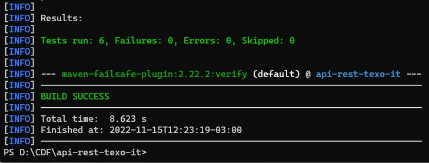
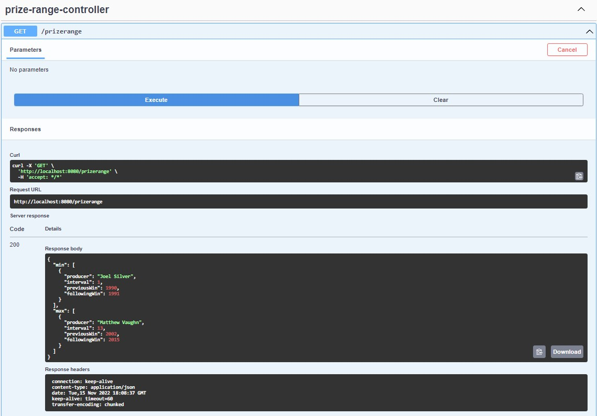

# API RESTful para possibilitar a leitura da lista de indicados e vencedores da categoria `Pior Filme` do Golden Raspberry Awards.

Este projeto é uma API que realiza a leitura de arquivos CSV informados na inicialização da aplicação para popular um banco de dados H2 em memória. 
O banco em memória pode ser acessado pela [URL do H2](http://localhost:8080/h2) com a `JDBC URL:` jdbc:h2:mem:moviebd  
Fornece um endpoint onde obtém-se os dados do produtor com maior intervalo entre prêmios e o que obteve prêmios mais rápido. 
Foi utilizado SpringDoc com OpenAPI para fornecer o acesso a testes do [endpoint /prizerange.](http://localhost:8080/swagger-ui/index.html)

## <strong>Requisitos</strong>

* `JDK 17` ou superior. 
* `Maven 3.6` ou superior. 

## <strong>Definições</strong>
* Se nenhum caminho de arquivo for informado na inicialização da aplicação ele irá utilizar a propriedade `movies-file-name` junto com o diretório de execução da aplicação para tentar importar o arquivo padrão (Já disponível na aplicação). 
Exemplo: Aplicação sendo executada no caminho `D:\CDF\api-rest-texo-it` com a propriedade `movies-file-name=`src/main/resources/movielist.csv  
Aplicação irá tentar ler o arquivo `D:\CDF\api-rest-texo-it\src\main\resources\movielist.csv` 
* Na criação de testes de integração tem equipes que optam por realizar o mock de alguns compentes. 
 Optei por não realizar nenhum tipo de mock e realizar o teste de ponta a ponta.  
Isso em um ambiente real seria validado com a equipe para saber qual é a abordagem padrão a ser seguida.

## <strong>Execução de testes</strong>
* No terminal acessar o diretório do projeto e executar o comando `mvn verify` que irá realizar a execução dos testes resultando em algo semelhante a imagem abaixo.  

  

  

## <strong>Execução da aplicação</strong>
* No terminal acessar o diretório do projeto e executar o comando  `mvn spring-boot:run` assim a aplicação será iniciada por padrão na porta 8080. 
* O mesmo comando pode receber o nome do arquivo que será utilizado para popular o banco de dados. 
Exemplo: Para considerar o arquivo `D:\movies\movielist_final.csv` execute o comando 
 `mvn spring-boot:run "-Dspring-boot.run.arguments=D:\movies\movielist_final.csv"` 
 * Também é possível iniciar aplicação através do arquivo `jar` informando o diretório do arquivo CSV para ser utilizado. 
 Exemplo: Executar no terminal o comando `mvn package` que irá gerar o `api-rest-texo-it-0.0.1.jar` no diretório target. 
 Acessar o diretório target e executar o comando  
 `java -jar api-rest-texo-it-0.0.1.jar D:\movies\movielist_final.csv` 

 ## <strong>Obtenção dos dados da API</strong>
 * Com a aplicação em execução acessar o endpoint http://localhost:8080/swagger-ui/index.html localizar o método `GET /prizerange` e clicar no botão `Try it out`. 
 * Será habilitado o botão `Execute`, e após a execução deve-se receber um retorno semelhante da imagem abaixo.

  

  
